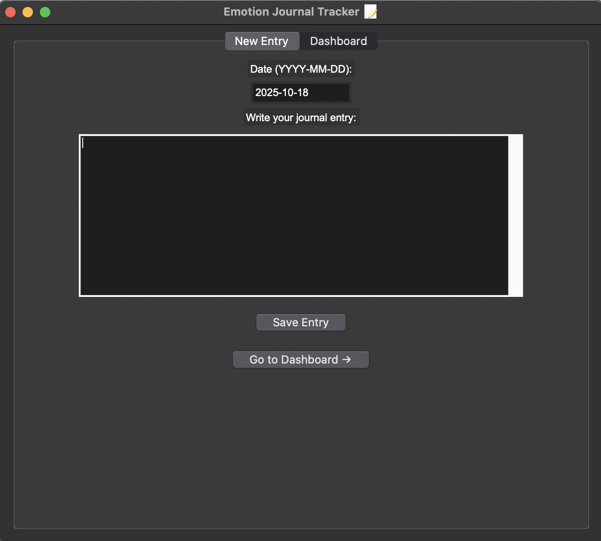
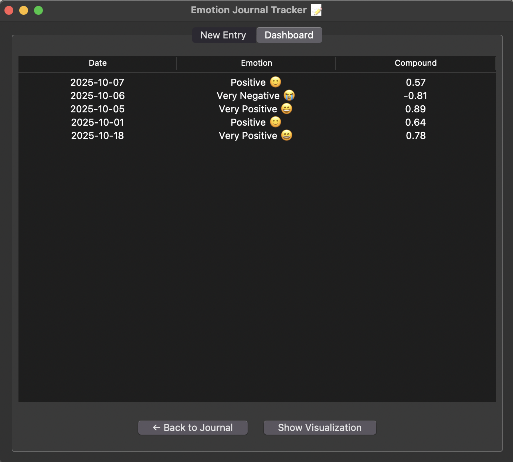
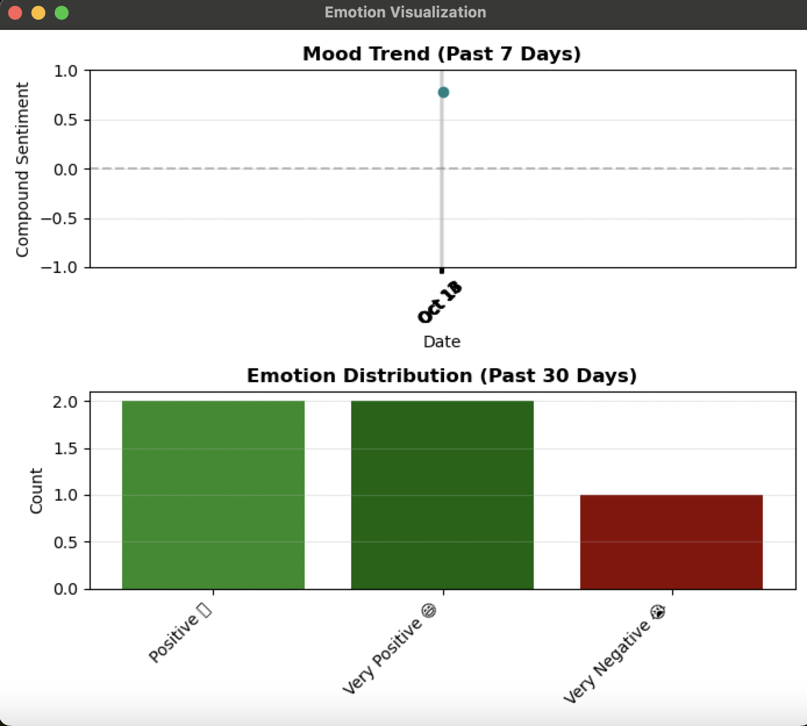

# Emotion Journal Tracker

This is an application that allows the user to write a journal. It can analyse the emotion written in the journal and output sentiment scores (positive, neutral or negative). In addition, it can also show visualisation for the emotion trend.

## Features
- Write and save journal entries
- Automatic sentiment analysis using the VADER model (NLTK)
- Emotion categorization with labels
- Dashboard view showing all saved entries
- Visualization of:
  • Mood trend (past 7 days)
  • Emotion distribution (past 30 days)
- CSV storage — entries are automatically loaded at startup

## Installation
1. Install python
   You can check with:
   python --version

2. Install the required libraries:
   pip install nltk pandas matplotlib

3. In case any of the nltk package is not installed properly, use the command:
   python3 -c "import nltk; import ssl; ssl._create_default_https_context = ssl._create_unverified_context; nltk.download('LIBRARY NAME')"

4. Run the program:
   python emotion_journal_tracker.py

## Usage
1. Write your journal entry in the “New Entry” tab.
2. Click “Save Entry” — the app will:
   - Analyze the text using the VADER sentiment model.
   - Classify the emotion (e.g., Positive, Negative, Neutral).
   - Save your entry with sentiment scores in journal_entries.csv.
3. Open the “Dashboard” tab to:
   - View saved entries.
   - Click “Show Visualization” to display:
     • A 7-day mood trend line chart
     • A 30-day emotion distribution bar chart

## Example Output
### Journal Entry Interface

### Saved Records Dashboards

### Mood Visualization

## References
1. Ali, M. (2023). NLTK sentiment analysis tutorial: Text mining & analysis in python. Www.datacamp.com. https://www.datacamp.com/tutorial/text-analytics-beginners-nltk
2. GeeksforGeeks. (2020, March 3). Customizing styles in matplotlib. 
3. GeeksforGeeks. (2021, May 6). Creating a list of range of dates in Python. GeeksforGeeks. https://www.geeksforgeeks.org/python/creating-a-list-of-range-of-dates-in-python/
4. GeeksforGeeks. https://www.geeksforgeeks.org/python/python-matplotlib-an-overview/GeeksforGeeks. (2025). Append dictionary to data frame. 
5. GeeksforGeeks. https://www.geeksforgeeks.org/python/append-dictionary-to-data-frame/
6. Guo, D. (n.d.). Make a README. Make a README. https://www.makeareadme.com/
7. Hunter, J. D. (2007). Matplotlib: A 2D Graphics Environment. Computing in Science & Engineering, 9(3), 90–95. https://ieeexplore.ieee.org/document/4160265
8. Hutto, C. J., & Gilbert, E. (2014). VADER: A parsimonious rule-based model for sentiment analysis of social media text. Proceedings of the International AAAI Conference on Web and Social Media, 8(1), 216–225. https://doi.org/10.1609/icwsm.v8i1.14550
9. Lundh, F. (2025). An introduction to tkinter. Pythonware.com. https://www.pythonware.com/library/tkinter/introduction/
10. Python Tutorial. (n.d.). How to use tkinter treeview to display tabular & hierarchical data. Python Tutorial - Master Python Programming for Beginners from Scratch. https://www.pythontutorial.net/tkinter/tkinter-treeview/
11. Sharma, A. (2019). Tkinter tutorial: Python GUI programming & how use tkinter to make GUI windows. Www.datacamp.com. https://www.datacamp.com/tutorial/gui-tkinter-pythons